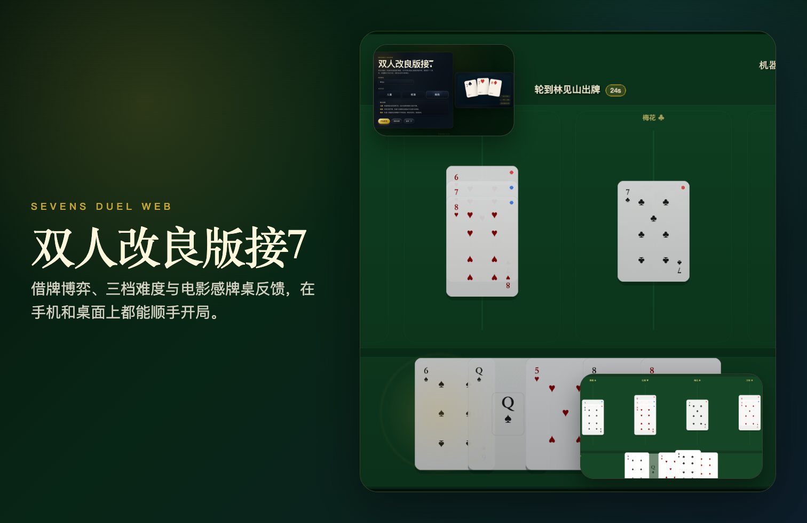
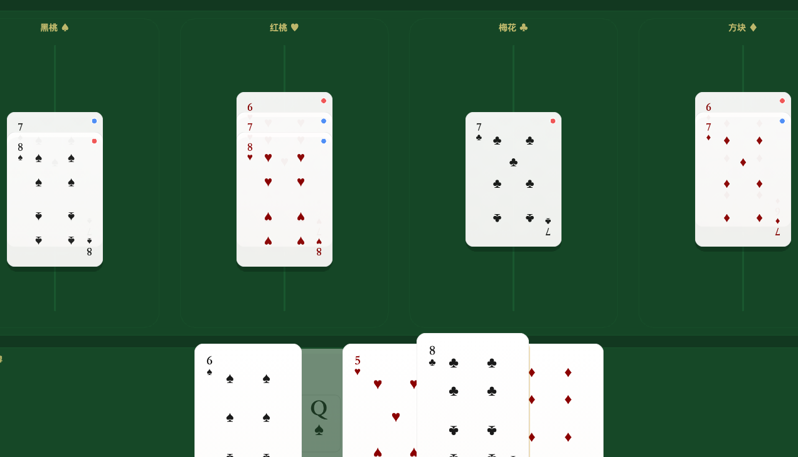

# Sevens Duel Web

`v1.0.0`

单机 机器人 对战的改良版接 7 Web 游戏。当前版本围绕“借牌博弈”重构了规则节奏与牌桌反馈：玩家输入姓名后进入牌局，在四条花色线上围绕 `7` 开线，通过出牌、卡位、借牌与反制，尽快让自己的手牌归零。



## 立即试玩

- 体验地址：[`Seven Duel`](https://sevens-duel-game.pages.dev/)
- 备用地址：[`Seven Duel`](https://unix2dos.github.io/sevens-duel-game/)

## 亮点

- 单机 机器人 对战，支持 `儿童 / 标准 / 挑战` 三档难度
- 首页支持输入并记住玩家姓名，整局文案与结果统计都会使用该姓名
- 牌桌基于 PixiJS 渲染，包含中心花色占位牌、动态高亮、回合提示与胜负特效
- 玩家回合带 `30 秒` 倒计时与提示按钮，找牌失败时可用高亮辅助定位合法牌
- 手牌支持二次点击确认出牌，非法尝试会触发抖动反馈；牌角索引已加大，更利于快速扫牌
- 手机与桌面双端可玩，包含单元测试、组件测试与 Playwright 烟测

## 游戏截图





## 正式规则

本作不是传统接 7 的原样移植，而是以“借牌决策”作为核心博弈点的双人对战变体。

1. 发牌与先手
   - 使用一副 52 张标准扑克牌，无大小王，双方各持 26 张。
   - 持有 `红桃 3` 的一方先行动。`红桃 3` 只决定先手，不要求打出。
2. 开线与接牌
   - 牌桌按花色分别接龙；某个花色尚未开线时，只能先打出该花色的 `7`。
   - 开线后，同花色向两端延伸：
     - 高位链：`7 -> 8 -> 9 -> 10 -> J -> Q -> K`
     - 低位链：`7 -> 6 -> 5 -> 4 -> 3 -> 2 -> A`
   - `A` 不接在 `K` 后面，只能在同花色 `2` 已经落桌后打出。
3. 回合行动
   - 轮到自己时，若手中存在合法牌，必须打出 1 张合法牌。
   - 玩家在手牌区点击一张牌会先选中，再次点击才会确认打出；点错非法牌会触发抖动反馈。
4. 借牌规则
   - 若当前没有任何合法牌，则必须向对手借 1 张牌。
   - 借牌时，由出借方决定交出哪一张牌；这是本作最核心的策略点。
   - 借到的牌先加入借牌方手牌；若因此出现合法牌，借牌方仍保有当前行动权，并自行选择是否立刻打出。
5. 胜负判定
   - 任意时刻，只要一方手牌数量变为 `0`，该方立即获胜。
   - 这包括两种情况：打出最后一张牌；或在对手借牌时交出自己的最后一张牌。

## 玩法概览

- 首页输入玩家姓名，选择 `儿童 / 标准 / 挑战` 难度后开始对局
- 牌桌中央四列分别代表四种花色；`7` 未落桌前，会先显示花色占位牌帮助识别牌路
- 玩家回合有 `30 秒` 倒计时；可以主动点击“提示”，超时后也会自动触发一次高亮提示
- 若机器人向玩家借牌，玩家需要从自己手牌中选一张并确认出借
- 对局结束后会在牌桌内显示结果弹窗、对局统计，并保留再来一局入口

## 模式说明

- `儿童`：保留更直白的落牌引导，适合先熟悉借牌与接龙节奏；机器人选牌更随机。
- `标准`：常规对局节奏；机器人会兼顾当前落点与后续可走牌路。
- `挑战`：机器人更重视后续牌路与节奏控制，随机性更低，强度最高。

## 当前体验

- 首页、对局、结果页使用统一的深色牌桌视觉语言
- 顶部状态栏同步显示当前回合、玩家与机器人手牌数，以及玩家姓名
- 玩家与机器人最近打出的牌会分别以蓝色 / 红色轮廓持续标记，便于复盘牌路
- 完成整条花色后会触发翻面庆祝；整局结束后会触发胜利 / 失败特效
- README 展示素材位于 `docs/assets/showcase/`
- 音效来源说明见 [audio-attribution.md](docs/assets/showcase/audio-attribution.md)

## 开发

安装依赖：

```bash
npm install
```

启动本地开发：

```bash
npm run dev
```

## 测试

单元与组件测试：

```bash
npm run test
```

端到端烟测：

```bash
npx playwright test e2e/smoke.spec.ts
```

## 构建

生产构建：

```bash
npm run build
```

本地预览：

```bash
npm run preview -- --host 127.0.0.1 --port 4173
```
