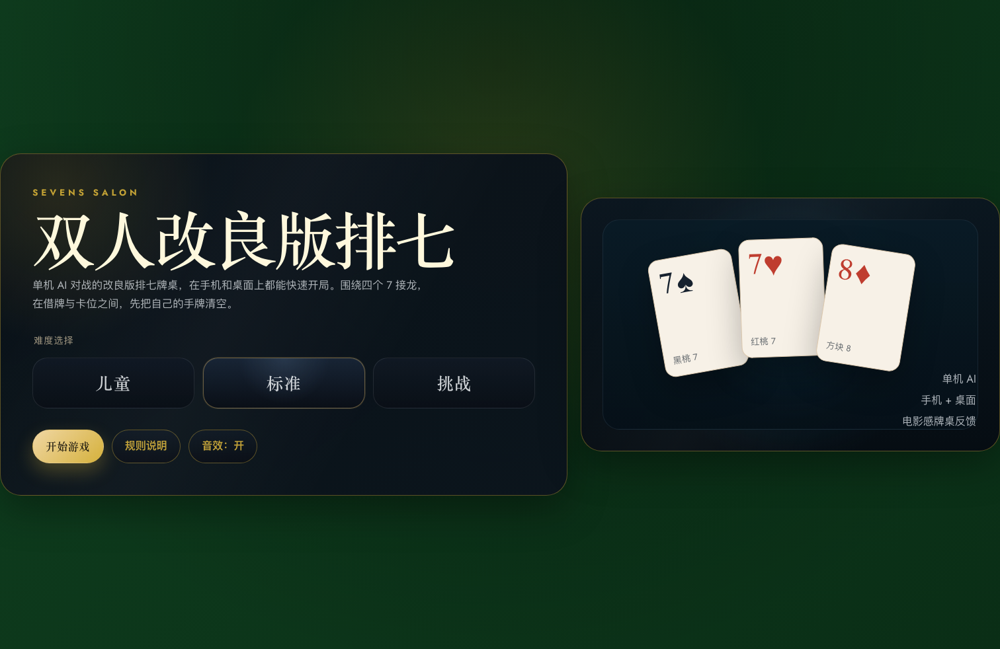
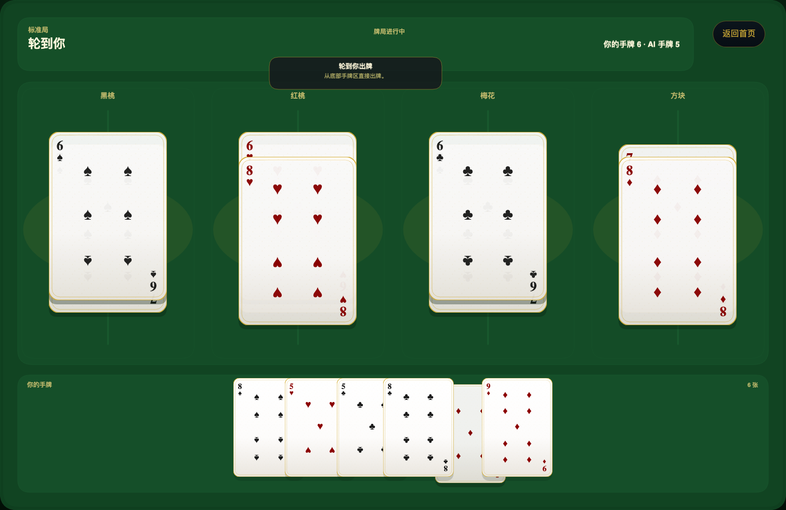
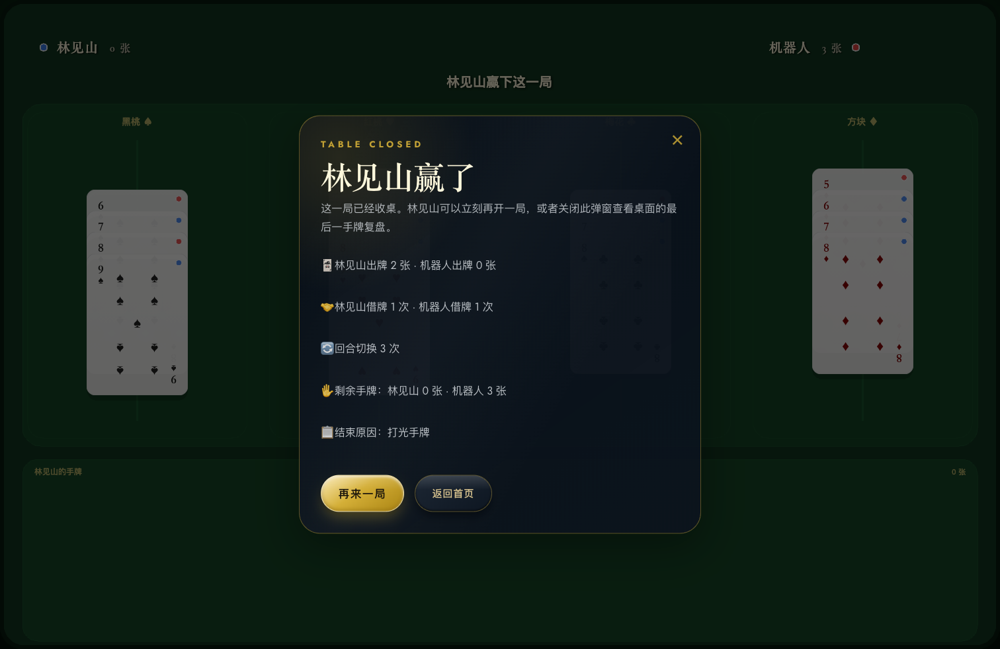
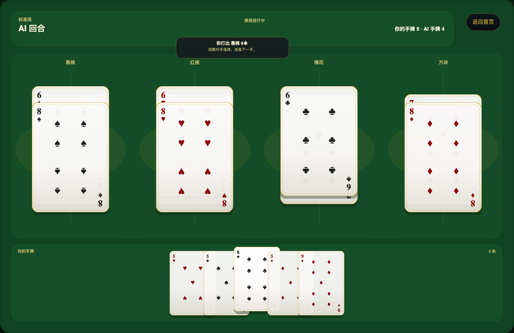

# Sevens Duel Web

单机 机器人 对战的改良版接7 Web 游戏，用一张深色绒面牌桌和一副真实扑克牌，把传统接龙规则做成更适合桌面与手机试玩的短局体验。

## 立即试玩

- 体验地址：[`Seven Duel`](https://sevens-duel-game.pages.dev/)
- 备用地址：[`Seven Duel`](https://unix2dos.github.io/sevens-duel-game/)

## 亮点

- 单机 机器人 对战，支持 `儿童 / 标准 / 挑战` 三档难度
- 基于 PixiJS 的牌桌场景与真实扑克牌表现
- 关键动作带短促音效反馈，试玩更接近成品体验
- 手机与桌面双端可玩，已有基础烟测覆盖

## 游戏截图







## 演示视频

[](docs/assets/showcase/sevens-duel-demo.mp4)

点击封面可查看仓库内的短演示视频，内容展示首页进入牌局、牌桌动效以及结果页闭环。

## 正式规则

本作不是传统接 7 的原样移植，而是以“借牌博弈”为核心的双人对战变体。

1. 发牌与先手
   - 使用一副 52 张标准扑克牌，无大小王，双方各持 26 张。
   - 持有 `红桃 3` 的一方先行动。`红桃 3` 只决定先手，不要求率先打出。
2. 开线与接牌
   - 牌桌按花色分别接龙；任一花色尚未开线时，该花色只能先打出 `7`。
   - 开线后，同花色向两端延伸：
     - 高位链：`7 -> 8 -> 9 -> 10 -> J -> Q -> K`
     - 低位链：`7 -> 6 -> 5 -> 4 -> 3 -> 2 -> A`
   - `A` 不接在 `K` 后面，只能在同花色 `2` 已经落桌后打出。
3. 回合行动
   - 轮到自己时，若手中存在合法牌，必须从手牌中打出 1 张合法牌。
   - 若手中没有任何合法牌，则必须向对手借 1 张牌。
4. 借牌规则
   - 借牌时，由出借方决定交出哪一张牌；这是本作最核心的策略点。
   - 借到的牌先加入借牌方手牌。
   - 若借牌后出现合法牌，借牌方继续保有当前行动权，并从手牌中选择 1 张合法牌打出。
5. 胜负判定
   - 任意时刻，只要一方手牌数量变为 `0`，该方立即获胜。
   - 这包括两种情况：打出最后一张牌；或在对手借牌时交出自己的最后一张牌。

## 玩法概览

- 围绕四个 `7` 开线，同花色分别向 `K` 与 `A` 两端延伸
- 借牌时由出借方决定给出哪一张，围绕手牌结构进行博弈
- 先让自己手牌归零的一方立即获胜；被借空同样算赢

## 体验特性

- 首页、对局、结果页使用统一的深色牌桌视觉语言
- 牌局信息聚焦在顶部状态、中央牌桌和底部手牌区
- README 展示素材位于 `docs/assets/showcase/`
- 音效来源说明见 [audio-attribution.md](docs/assets/showcase/audio-attribution.md)

## 开发

安装依赖：

```bash
npm install
```

启动本地开发：

```bash
npm run dev
```

## 测试

单元与组件测试：

```bash
npm run test
```

端到端烟测：

```bash
npx playwright test e2e/smoke.spec.ts
```

## 构建

生产构建：

```bash
npm run build
```

本地预览：

```bash
npm run preview -- --host 127.0.0.1 --port 4173
```
