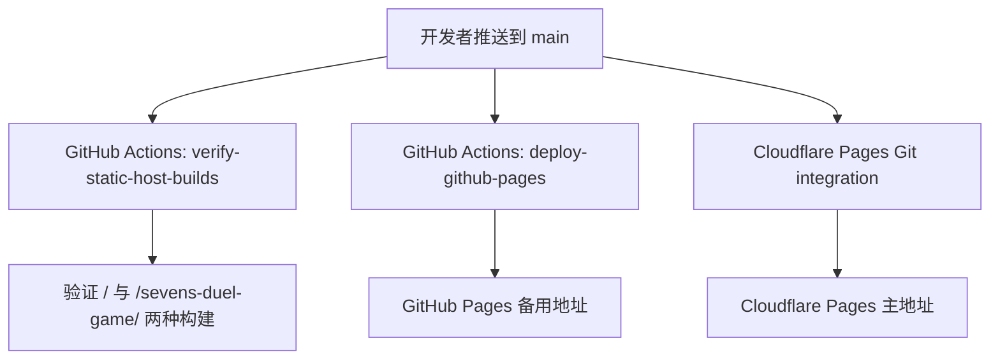

# 双部署方案设计文档

## 1. 背景

当前仓库已经具备两个静态托管目标所需的基础条件：

- GitHub Pages 有现成的 GitHub Actions 发布流程。
- Vite `base` 已通过 `VITE_BASE_PATH` 支持根路径和子路径两种构建。
- README 中已经记录了 Cloudflare Pages 与 GitHub Pages 两个公开地址。

但当前仓库内的表达仍然容易让人误解成“GitHub Actions 会同时把站点推到 GitHub 和 Cloudflare”。实际并不是这样：Cloudflare 更适合使用平台原生的 Git integration，而不是由 GitHub Actions 直接上传产物。

## 2. 目标

这次调整的目标是把部署策略收敛成一个清晰、可维护的双部署基线：

- Cloudflare Pages 作为主站，使用 Cloudflare 自己的 Git integration 跟踪 `main`。
- GitHub Pages 作为备用站，继续使用仓库内的 GitHub Actions workflow 从 `main` 自动发布。
- 在仓库内补上能验证这两种静态构建都持续可用的 CI。
- 用文档把职责边界说明清楚，避免后续重复引入 Cloudflare 直传 workflow。

## 3. 设计结论

### 3.1 选定方案

采用“平台各自原生发布 + 仓库内统一验证”的双部署设计：

- `Cloudflare Pages`
  - 发布方式：Cloudflare Git integration
  - 触发源：`main` 分支更新
  - 构建路径：根路径 `/`
- `GitHub Pages`
  - 发布方式：GitHub Actions
  - 触发源：`main` 分支更新
  - 构建路径：`/sevens-duel-game/`
- `GitHub Actions CI`
  - 职责：在 PR 和 `main` 上分别验证 Cloudflare 与 GitHub Pages 两种构建参数都能成功产出
  - 职责边界：不负责向 Cloudflare 上传产物

### 3.2 不采用的方案

不采用“GitHub Actions 同时部署 GitHub Pages 和 Cloudflare Pages”的方案，原因如下：

- 需要在 GitHub 侧额外维护 Cloudflare API Token，增加 secret 管理成本。
- 把 Cloudflare 的原生 Git integration、预览环境和平台侧状态检查绕开了。
- 会让仓库维护者误以为两个平台都由同一条 workflow 控制，增加故障排查复杂度。

## 4. 实现范围

### 4.1 本轮要做

- 新增一个 GitHub Actions workflow，持续验证根路径构建和 GitHub Pages 子路径构建。
- 明确现有 GitHub Pages workflow 只负责 GitHub Pages 发布。
- 更新部署文档，写清双部署拓扑、配置步骤和运维流。
- 更新 README 部署部分，避免“主站/备用站/触发方式”表述含混。

### 4.2 本轮不做

- 不在 GitHub Actions 中新增 Cloudflare 直传步骤。
- 不新增 `wrangler.toml` 或 Cloudflare Worker 运行时能力。
- 不尝试在本地或仓库内自动创建 Cloudflare Pages 项目。
- 不变更现有应用代码和静态资源结构。

## 5. 配置流

## 6. 风险与缓解

- Cloudflare 项目若没有正确指向 `main`，仓库改动不会自动上线主站。
  - 缓解：文档中明确生产分支与构建参数。
- 开发者只验证 GitHub Pages 子路径构建，可能忽略 Cloudflare 根路径构建回归。
  - 缓解：新增双构建校验 workflow。
- 后续有人再次尝试在 GitHub Actions 中加入 Cloudflare 上传步骤，导致职责重复。
  - 缓解：在 workflow 与部署文档中明确职责边界。

## 7. 验证方式

这次变更完成后，需要满足以下事实：

- `npm run build` 可以成功，代表 Cloudflare 根路径构建正常。
- `VITE_BASE_PATH=/sevens-duel-game/ npm run build` 可以成功，代表 GitHub Pages 子路径构建正常。
- 新增的 CI workflow YAML 语法合法。
- README 与部署文档对双部署职责的描述一致。
