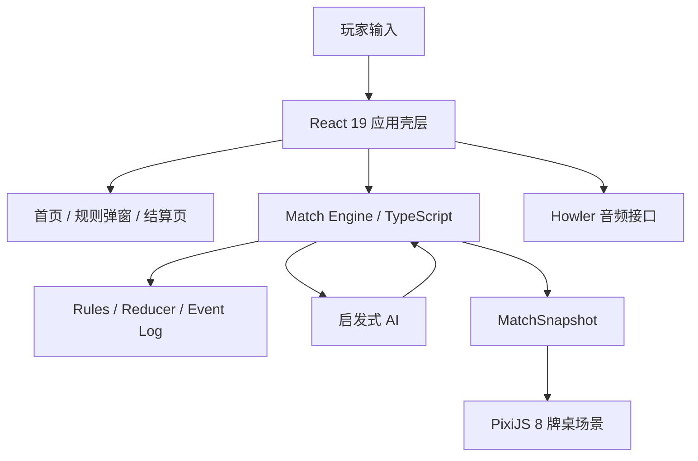

# Sevens Duel 运行时技术全景与决策记录

> 快照时间：2026-03-15

## 1. 这份文档记录什么

这份文档只记录本仓库的**核心运行时技术**，不展开构建、测试、Lint 或发布流程。

如果只记一句话，这个项目当前是一个：

**`React 19` 壳层 + `PixiJS 8` 对局主舞台 + `TypeScript 5` 规则引擎 + 本地启发式 AI + `Howler 2` 音频接口**

的单机 Web 游戏。

### 证据标签

- `已确认`：代码或仓库内现有文档可以直接证明。
- `我推断`：代码无法直接证明，但从现状能合理推出来的决策动机、收益或代价。

## 2. 运行时总览

- `已确认`：项目入口非常薄，`src/main.tsx` 只负责挂载 React 根节点。
- `已确认`：顶层状态集中在 `src/App.tsx`，包括当前页面、难度、规则弹窗、音效开关和整局 `match`。
- `已确认`：首页、规则弹窗、结算页由 React 组件负责；对局主舞台由 Pixi 场景负责。
- `已确认`：规则、事件、状态、AI 都在本地 TypeScript 模块内完成；仓库里没有网络请求、路由依赖或持久化实现。
- `我推断`：作者刻意把项目收敛成“纯前端、内存态、单机可玩”的结构，优先保证一局牌的完整体验，而不是先搭复杂基础设施。

### 2.1 运行时分层一览

| 层 | 主要技术 | 角色 | 证据级别 |
| --- | --- | --- | --- |
| 应用壳层 | React 19 | 页面切换、顶层状态、副作用调度 | 已确认 |
| 对局渲染层 | PixiJS 8 | 牌桌场景、图层合成、交互命中 | 已确认 |
| 规则核心 | TypeScript 5 + 纯函数模块 | 牌型、状态、事件、规则、Reducer | 已确认 |
| AI 层 | 自研启发式评分 | 三档难度决策 | 已确认 |
| 音频层 | Howler 2 + `useSound` | 音效调用接口 | 已确认 |

### 2.2 技术结构图

### 2.3 一局牌怎么跑起来

1. `已确认`：玩家在 React 首页选择难度并点击开始，`App.tsx` 调用 `createMatch()` 生成初始对局快照。
2. `已确认`：React 把 `match.snapshot` 传给 `GameScreen`，再传给 `GameScene`。
3. `已确认`：`GameScene` 通过 `usePixiHost()` 挂载 Pixi `Application`，并用 `createTableView()` 把快照画成牌桌。
4. `已确认`：玩家出牌或借牌时，React 只提交动作；真正改状态的是 `dispatchHumanAction()` 和底层规则模块。
5. `已确认`：轮到 AI 时，React `useEffect` 延迟调用 `dispatchAiTurn()`，AI 决策仍然回到同一个规则入口。
6. `已确认`：对局结束后，React 用 `startTransition()` 切到结算页。

## 3. 核心技术逐层说明

### 3.1 React 19：应用壳层，不是整局渲染引擎

**现状**

- `已确认`：`App.tsx` 维护 `screen`、`selectedDifficulty`、`rulesOpen`、`soundEnabled`、`match` 这些顶层状态。
- `已确认`：项目没有引入路由库、全局状态库或服务端状态管理；页面切换依靠本地 `screen` 枚举完成。
- `已确认`：React 负责首页、规则弹窗、结果页，以及对局外层按钮和借牌确认浮层。
- `已确认`：React 还负责用 `useEffect` 协调 AI 回合与儿童模式自动行为。
- `我推断`：这里的 React 定位更像“应用壳层”和“编排层”，而不是一切都用 DOM 画出来的唯一 UI 引擎。

**用途**

- `已确认`：承载结构化页面内容。
- `已确认`：维护整局的生命周期状态。
- `已确认`：调度用户操作、AI 回合和音效调用。

**收益**

- `我推断`：首页、弹窗、结算页这类结构化界面用 React 写更快，也更容易改版。
- `我推断`：把对局外逻辑留在 React，能避免把所有状态都塞进 Pixi 场景对象。
- `我推断`：不引入路由和全局状态库，降低了这个单机项目的理解门槛。

**代价**

- `我推断`：React 与 Pixi 之间必须通过快照和回调对接，天然会有一层边界成本。
- `我推断`：一部分对局 UI 还停留在 DOM 浮层里，说明“壳层”和“主舞台”的分界仍需维护。
- `已确认`：当前整局状态只存在内存里；刷新页面会丢局。

### 3.2 PixiJS 8：对局主舞台与视觉重心

**现状**

- `已确认`：`GameScene.tsx` 使用 `usePixiHost()` 创建并挂载 Pixi `Application`。
- `已确认`：Pixi 初始化参数明确开启 `antialias`、`autoDensity`、`resizeTo` 和 WebGL 偏好。
- `已确认`：`TableView.ts` 将对局场景拆成 `TopStatusLayer`、`OpponentLayer`、`SuitBoardLayer`、`TransientFeedLayer`、`PlayerHandLayer` 五层。
- `已确认`：玩家手牌、四花色牌位、桌面背景和大部分对局反馈都已经在 Pixi 里绘制。
- `已确认`：现有设计文档明确写了 `Pixi-first`，并说明原因是对局页需要更强电影感，以及避免 DOM 与 Canvas 分裂。

**用途**

- `已确认`：渲染真实牌桌、扑克牌、进场动画和桌内反馈。
- `已确认`：统一管理牌的视觉层级、命中区域和场景布局。

**收益**

- `已确认`：根据现有设计文档，Pixi 的核心收益是把“真实牌桌感”“电影感动效”“主舞台统一渲染”放进同一系统里。
- `我推断`：对手牌轻叠、花色竖向接龙和临时提示这类画面，Pixi 比纯 DOM 更容易做出稳定的一致性。
- `我推断`：分层渲染让牌桌视觉可以继续演进，而不必把所有交互和布局纠缠在一个 React 组件里。

**代价**

- `我推断`：Pixi 的学习和维护成本高于普通 DOM 布局，尤其是命中区域、坐标系、层级和重绘心智模型。
- `我推断`：测试可见性和可访问性会比 DOM 方案弱，很多内容对自动化和屏幕阅读器都不天然友好。
- `已确认`：测试环境里专门跳过了 Pixi 初始化，这说明它已经不是“零成本 UI 依赖”。

### 3.3 TypeScript 5：规则、状态与事件的共同语言

**现状**

- `已确认`：`src/game/core/types.ts`、`state.ts`、`events.ts` 定义了卡牌、手牌、回合、阶段、事件日志等核心领域类型。
- `已确认`：`rules.ts` 只处理“这张牌现在能不能出”和“哪些牌合法”。
- `已确认`：`reducer.ts` 处理出牌、借牌、让牌、回合推进、结束判定和事件追加。
- `已确认`：`engine.ts` 负责把“人类动作 / AI 动作”收口成统一快照更新接口。
- `已确认`：`replayMatch()` 基于事件日志重放整局，这说明事件流不是装饰，而是状态模型的一部分。
- `我推断`：作者有意识地把“游戏规则”从 React 和 Pixi 中抽离，避免视觉层决定规则。

**用途**

- `已确认`：为卡牌规则、状态机和对局快照提供统一类型系统。
- `已确认`：让 UI 层和 AI 层都消费同一份规则结果。

**收益**

- `我推断`：规则核心保持纯函数，测试和重放都更直接。
- `我推断`：UI 重构时，只要 `MatchSnapshot` 结构不被破坏，就可以大幅替换视觉实现。
- `我推断`：TypeScript 在这里不是“加类型”而已，而是把规则边界做成显式契约。

**代价**

- `我推断`：模块拆得更清楚，意味着调用链更长，理解成本会上升。
- `我推断`：当产品需求变得更复杂时，事件、状态、Reducer 三层都要同步演化，样板代码会增加。
- `我推断`：这种分层很适合规则稳定的卡牌游戏，但对快速试错的新玩法会显得偏重。

### 3.4 启发式 AI：轻量、本地、可控的难度系统

**现状**

- `已确认`：`child`、`normal`、`challenge` 三档 AI 都基于相同的 `Observation` 输入。
- `已确认`：三档 AI 的差异不在流程，而在评分函数：都先筛合法牌，再按不同启发式分数排序取第一张。
- `已确认`：`heuristics.ts` 当前使用了牌权重、未来可行动数、对手手牌数和伪随机扰动。
- `已确认`：AI 决策完全在前端同步完成，没有网络依赖。

**用途**

- `已确认`：给单机对局提供三档强度不同、响应即时的对手。

**收益**

- `我推断`：这种 AI 结构最重要的收益是简单、可调、可解释。
- `我推断`：三档难度共用一套观察模型和决策骨架，比三套完全独立逻辑更容易维护。
- `我推断`：同步、本地、无服务端的 AI 很适合这个项目当前的轻量运行时目标。

**代价**

- `我推断`：它的上限明显受限于启发式质量，不会出现真正深度搜索式的牌局规划。
- `我推断`：难度调优主要靠手工改权重，后续如果玩法增加，经验调参会越来越脆弱。
- `我推断`：伪随机扰动能让 AI 不那么死板，但也会降低“为什么这么出牌”的直觉一致性。

### 3.5 Howler 2：先稳定接口，再补真实音效

**现状**

- `已确认`：项目依赖了 `howler`，并在 `useSound.ts` 里封装了统一的 `playSound()` 接口。
- `已确认`：`App.tsx` 在开始游戏、出牌、借牌、重开等节点都调用了 `playSound()`。
- `已确认`：当前 `soundDefinitions` 只有 `volume`，没有任何 `src`；因此 `useSound()` 最终会把所有音效实例设为 `null`。
- `已确认`：这意味着音频层的调用路径已经接好，但默认并不会播放真实声音。

**用途**

- `已确认`：提供统一的音效调用接口，避免把音频播放逻辑散落到 UI 各处。

**收益**

- `我推断`：先把调用接口稳定下来，再晚一点补素材，是一种低风险的演进顺序。
- `我推断`：Howler 的价值主要在跨浏览器封装和后续扩展余地，而不是当前这版的实际音效表现。

**代价**

- `已确认`：现在的音频层已经引入了依赖和抽象，但用户暂时得不到实际声音反馈。
- `我推断`：如果后续长期不接素材，这层会变成“有接口、无体验”的半成品。
- `我推断`：当真实音效上线后，还要重新校准时机、音量和与动画的节奏关系。

## 4. 三个关键技术决策

### ADR-01：对局主界面采用 Pixi-first，而不是纯 DOM/CSS

**状态**

- `已确认`：已采纳。

**背景**

- `已确认`：现有设计文档把这次重构目标定义为更强的真实扑克牌感、牌桌感和电影感。
- `已确认`：设计文档明确写出“对局主页面走 Pixi-first，非对局页面仍由 React 负责结构与内容”。

**决策**

- `已确认`：对局主舞台由 Pixi 主导渲染，React 退到页面壳层。

**为什么选它**

- `已确认`：现有设计文档直接给出的原因是，需要更强电影感，并把真实手牌、短暂提示和关键动画放进同一渲染系统。
- `我推断`：这也是为了避免复杂牌面布局在 DOM 与 Canvas 之间来回拆分。

**为什么没选别的**

- `我推断`：没选“纯 DOM/CSS + React”是因为真实牌叠放、场景层级和动画节奏会更难统一。
- `我推断`：没选“React 负责全部渲染，Pixi 只做局部特效”是因为那会把交互与视觉分到两套主系统里，边界更乱。

**收益**

- `已确认`：画面一致性更强，牌桌主舞台更集中。
- `我推断`：未来继续打磨卡牌、动效和桌面层次时，Pixi 会比 DOM 更从容。

**代价**

- `我推断`：工程复杂度、调试成本和无障碍成本都会上升。
- `已确认`：测试环境已经需要绕开 Pixi 初始化，说明它确实增加了运行时边界。

**何时重审**

- `我推断`：如果未来重点从“电影感牌桌”转向“高可访问性、强可测性、低维护成本”，这项决定就该重审。

### ADR-02：规则引擎保持在纯 TypeScript 模块中，而不是嵌进 UI

**状态**

- `已确认`：已采纳。

**背景**

- `已确认`：规则判断、状态推进、事件日志、AI 观察模型分散在 `src/game/` 下的独立模块中，而不在 React 或 Pixi 文件里。

**决策**

- `已确认`：用 `rules.ts + reducer.ts + engine.ts + types/state/events.ts` 构成规则核心，UI 只提交动作和消费快照。

**为什么选它**

- `我推断`：这是为了把“规则正确”与“视觉呈现正确”拆成两件事，各自独立演进。
- `已确认`：事件日志可重放，说明规则层被设计成可以脱离 UI 独立工作。

**为什么没选别的**

- `我推断`：没选“把出牌合法性和回合推进直接写在组件或场景对象里”，是为了避免 UI 重构时把规则一起打碎。
- `我推断`：没选更重的状态机框架，是因为当前牌局流程有限，纯 TypeScript 已经足够清晰。

**收益**

- `已确认`：规则逻辑可以被单独测试和重放。
- `我推断`：Pixi 和 React 任何一层重做，只要快照契约不变，游戏核心就不需要跟着重写。

**代价**

- `我推断`：需要维护动作、快照、事件之间的多层映射，理解路径比“全写在组件里”更长。
- `我推断`：产品规则一旦频繁变化，这套分层会让改动面变宽。

**何时重审**

- `我推断`：如果未来玩法分支暴增，或者需要更强的可视化状态机表达，再评估是否引入更正式的状态建模工具。

### ADR-03：AI 采用启发式评分，而不是搜索型或服务端 AI

**状态**

- `已确认`：已采纳。

**背景**

- `已确认`：当前 AI 没有树搜索、没有异步请求、没有模型调用，只有基于观察结果的本地评分。

**决策**

- `已确认`：三档难度共用一套观察与决策骨架，只替换评分函数。

**为什么选它**

- `我推断`：这个项目的目标首先是“单机可玩、即时响应、维护成本可控”，启发式 AI 最符合这三个约束。
- `我推断`：对于排七这种规则明确、动作空间相对有限的游戏，启发式评分足以支撑基础对局体验。

**为什么没选别的**

- `我推断`：没选 Minimax / Monte Carlo 一类搜索，是为了避免在浏览器端引入更高的复杂度和调优成本。
- `我推断`：没选服务端 AI，是因为这会立刻打破当前“纯前端、单机、零网络依赖”的运行时结构。

**收益**

- `已确认`：AI 回合完全本地同步完成，响应快，没有等待链路。
- `我推断`：三档难度通过调权重就能分层，比维护三套独立 AI 更省心。

**代价**

- `我推断`：AI 的牌力天花板有限，复杂局面的长期规划能力弱。
- `我推断`：当用户开始追求“更像高手”的对手时，这套方案会先触顶。

**何时重审**

- `我推断`：如果未来重点变成“强策略体验”而不是“轻量单机体验”，AI 方案应该优先重审。

## 5. 当前方案最值得记住的限制

- `已确认`：项目没有路由、没有后端、没有持久化；这是一个完全依赖浏览器内存的单机运行时。
- `我推断`：这让产品更轻，但也意味着“继续一局”“跨设备同步”“局后分析存档”都还没有落脚点。
- `已确认`：Howler 接口已经存在，但默认没有音频素材。
- `我推断`：这说明当前运行时优先级仍然偏向视觉与规则闭环，而不是完整感官体验。
- `已确认`：对局主舞台已经明显偏向 Pixi。
- `我推断`：如果后续继续加大量 DOM 浮层，会破坏现在这套“壳层与主舞台分工”的清晰度。

## 6. 不在本文展开的技术

- `已确认`：项目还用了 `Vite 8`、`Vitest`、`Playwright`、`Testing Library`、`ESLint`。
- `已确认`：这些技术对工程效率很重要，但不属于本文要记录的“核心运行时技术”。

## 7. 给未来自己的最短复述

- `已确认`：这不是一个“React 把所有牌面都画出来”的项目。
- `已确认`：它当前的正确理解方式是“React 管壳层与调度，Pixi 管对局主舞台，TypeScript 规则核心提供唯一真相，AI 在本地基于规则快照做轻量决策，Howler 预留统一音频接口”。
- `我推断`：这套结构的真正优先级是：先把单机牌局的视觉完成度和规则闭环做扎实，再决定要不要上更重的基础设施。
